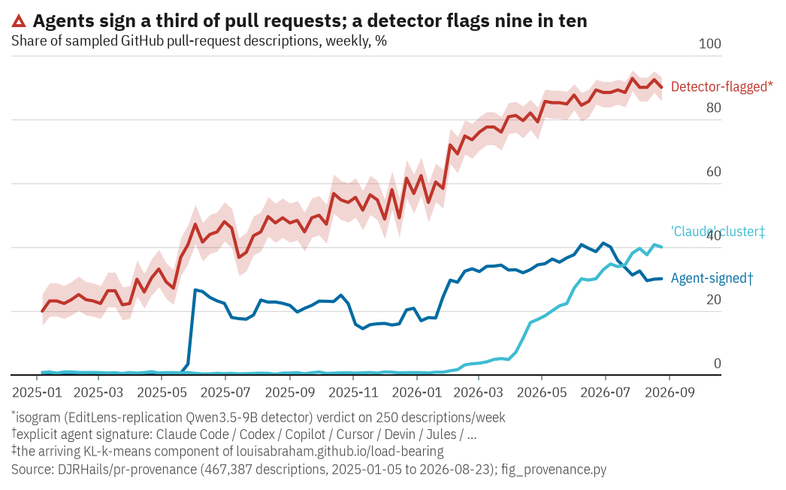

# pr-provenance

**Who — or what — wrote this pull request?** A dataset of GitHub pull-request descriptions with
per-document provenance labels: the *way of writing* it clusters into, the *coding agent* that
signed it, the *model* where the signature names one, and an *AI-text-detector score* from
[isogram](https://github.com/DJRHails/isogram) (private repo; an EditLens replication).

**Live board: [isogram.hails.info/github](https://isogram.hails.info/github)** — statically
rendered React (isogram's web app): provenance composition, the arriving cluster's vocabulary
with clickable word-lines, and the named-Claude-version timeline. Data baked from this repo by
`scripts/build_isogram_site_data.py`. (An earlier, dependency-free SVG board remains at
[djrhails.github.io/pr-provenance](https://djrhails.github.io/pr-provenance/), rebuilt weekly.)

Bootstrapped from **[louisabraham/load-bearing](https://github.com/louisabraham/load-bearing)**
(MIT) — the corpus behind *[The load-bearing vocabulary of
Claude](https://louisabraham.github.io/load-bearing/)* — whose methodology this repo first
replicates exactly and then extends from aggregates to per-document labels.

## Replication, verified

Upstream fits KL k-means (k=10) over word counts of sampled PR descriptions and shows one
cluster "arriving": 0.9% of the corpus in early 2025 → 37.4% by late August 2026, with
`load-bearing`, `plainly`, `genuinely`, `nowhere`, `premise` among its most characteristic
words — vocabulary distinctive of Claude.

- Re-running vendored `analyze.py` on the bootstrapped corpus (upstream commit `a446ffb`)
  reproduces the published `analysis.js` **byte-identically** (467,387 documents, 52,506,137
  word appearances, cost 129,872,592.4, seed 3, arrival confirmed).
- `scripts/assign_clusters.py` re-runs the published fit and exports what the page never shows —
  the cluster of every kept document — asserting exactness at every seam: document count,
  appearance count, fit cost under the published seed, and every component's weekly count series.
- `verification/refetch_2026-08-30.jsonl` is our **independent re-collection** of a day already
  in the corpus (the sampling windows are seeded on the date): 998/1000 rows overlap with
  upstream's file, 997/998 bodies byte-identical (the deltas are PRs edited or deleted since).

## Layout

| path | what it is |
|---|---|
| `data/days/YYYY-MM-DD.jsonl` | the corpus: ~1,000 PR descriptions/day (`ts`, `repo`, `author`, `body`), 2025-01-01 →, immutable files. Through 2026-08-30 bootstrapped from upstream; grown daily by `.github/workflows/daily.yml` after that. |
| `vendor/` | upstream `fetch_day.py` + `analyze.py`, unmodified (MIT, `LICENSE.upstream`, commit in `UPSTREAM_COMMIT`) |
| `analysis/analysis.js` | our re-run of the upstream fit (byte-identical to the published one) |
| `labels/assignments.parquet` | per kept document (`day`, `line` → `week`, `component` 0–9 in the published order, `lead`) |
| `labels/agents.parquet` | per raw document: signing `agent`, `model_raw`/`model` where named, `bot_author`, review-bot mentions |
| `labels/stylometric.parquet` | unsigned kept documents: predicted agent + confidence (bag-of-words over prose with signatures and URLs stripped) |
| `labels/isogram_full.parquet` | detector verdicts for **every** kept document (467,387 rows: `iso_label`, `iso_ai_touched`, `iso_score`, `iso_ai_prob`, …) |
| `labels/isogram_sample.parquet` / `labels/isogram_scores.parquet` | stratified 250/week sample (21,500 docs) and its verdicts — the figure's CI-bearing estimate |
| `labels/embedding_attribution.parquet` | unsigned detector-flagged rows: calibrated family posteriors from the detector's own embedding (`family_pred`, `family_conf`, per-class `p_*`) |
| `scripts/` | everything above is one script each; all run from a clean checkout (`PYTHONPATH=. python scripts/<x>.py`) |

Join key throughout: **(`day`, `line`)** — the day file and 0-based line number in it.

## Staying in sync

The dataset is self-syncing at two cadences (`.github/workflows/daily.yml`):

- **Daily**: fetch yesterday's ten windows into `data/days/`, refresh the per-row signature
  labels (`labels/agents.parquet`) — append-only facts, stable across refits.
- **Weekly** (Mondays, once the new whole week has closed): re-run the KL-k-means fit on the
  grown corpus and rebuild the fit-dependent labels (`analysis/analysis.js`,
  `labels/assignments.parquet`, `labels/stylometric.parquet`). A refit reassigns *every*
  document, so these churn by design; each refresh is one commit and the git history is the
  version history.
- **On GPU demand**: detector labels for new weeks are appended by running isogram's
  `scripts/score_pr_corpus.py` over the new rows on the cluster and committing the grown
  `labels/isogram_full.parquet`; per-row scores never churn.

The README's Results section is a dated snapshot (numbers as of **2026-08-31**, corpus through
2026-08-30); regenerate its tables any time with `scripts/summarize.py`.

## Results

All numbers below reproduce from `PYTHONPATH=. python scripts/summarize.py` over the committed
labels; the figure from `scripts/fig_provenance.py`.

### Who signs their work

Of 603,953 raw descriptions, **126,124 (20.9%) carry an explicit coding-agent signature**:
Claude Code 51,060 · Codex 43,597 · Copilot 16,690 · Jules 9,617 · Cursor 2,472 · Devin 1,829 ·
others <300 each. In the kept (clustered) corpus the signed share grows 0.1% (2025-Q1) → 36.5%
(2026-Q2). Two histories inside that: **Codex signatures peak in 2025-Q3 (18.7%) and collapse to
1% by 2026-Q3**, while Claude Code grows monotonically to 27.3% — though footer conventions are
themselves product decisions, so a vanishing signature is evidence about the footer, not
necessarily about usage.

**Which model?** Signatures rarely say. 50,645 of 51,060 Claude Code trailers read bare
`Co-Authored-By: Claude`; the 955 versioned trailers across all rows name `claude-opus-4-8`
(203), `claude-sonnet-5` (144), `claude-opus-4-6` (127), `claude-opus-5` (112),
`claude-opus-4-7` (105), `claude-fable-5` (93), and six others. Codex/Copilot/Devin footers
never name a model. So model attribution beyond the agent is only possible for ~0.2% of rows
from signatures alone — the honest answer to "which model generated this?" is usually "which
agent", plus the cluster/style evidence below.

### The clusters are agent house styles

Cross-tabbing cluster × signature (kept corpus): **the upstream page's arriving component is
Claude-specific** — 37.2% of Claude-Code-signed docs land in it against **0.03% of
Codex-signed** (13 of 39,469); Codex dominates a different component (the one whose top word is
the `chatgpt.com` task-link domain). A TF-IDF logistic classifier over signed docs — signatures
and URLs stripped, train/validation split by author — separates claude-code / codex / cursor /
jules prose at **98.3% accuracy** (macro-F1 0.978), so the "ways of writing" the unsupervised
fit found really are agent styles, recoverable from prose alone.

### isogram: human vs non-human

**Every kept document is scored** (`labels/isogram_full.parquet`, 4×H200 for ~85 min) with the
shipped isogram text detector (Qwen3.5-9B QLoRA, EditLens-style regression + binary head,
val-fit threshold); the stratified 250/week sample was scored first and agrees with the census
within ≤1.1pp in every quarter. Full-corpus numbers:

| | n | flagged AI |
|---|---|---|
| signed by any agent | 97,995 | **94.4%** |
| — Claude Code | 49,507 | 98.8% |
| — Codex | 39,469 | 90.6% |
| — Jules | 6,024 | 98.0% |
| — Cursor | 1,915 | 45.0% |
| — Devin | 284 | 96.8% |
| unsigned | 369,392 | 46.9% |
| unsigned, in the lead cluster | 20,387 | 91.4% |
| unsigned, other clusters | 349,005 | 44.3% |

The signatures validate the detector in the wild (it never saw PR text in training): 98.8% of
Claude-Code-signed descriptions are flagged. The Cursor exception is informative — Cursor-agent
PR bodies often carry the human's own task prompt inside the agent's wrapper, and the detector
reads them as human (mean score 0.05).

**The AI-touched share rises 22.8% (2025-Q1) → 89.4% (2026-Q3), against a measured
false-positive floor of 11.75%.** The corpus now extends back to 2021 (coarse-to-fine
backfill: whole weeks at half-yearly, then quarterly, then monthly, then full weekly
resolution), and the pre-agent history turns the old baseline ambiguity into a measurement:
across 2021–2022 (census, n=99,950, signatures 0.00%) the detector flags **11.75%
[11.55, 11.95]** — flat for 24 sampled weeks (range 10.5–12.6%, mean score pinned at 0.033).
That is the instrument's FP rate on this register at the deployed threshold — an upper bound,
since any true AI text in 2021–22 counts against it. On top of that floor: a modest
ChatGPT-era lift from May 2023 (~+3–4pp, half-year means 12.7% → 15.7%), a plateau through
2024-H1, and a sharp takeoff pinned to the **week of 2024-10-21** (16.0% → 21.5% → 24.2% by
early November, mean scores jumping 0.037 → 0.046) — the start of the agentic-coding wave,
running unbroken to 89% by 2026-Q3. The *trend* remains the finding: +67pp over 2025–26 while
signatures explain only +33pp — **roughly one unsigned AI description for every signed one.**

### The unsigned AI: mostly Claude-styled

Unsigned docs the detector flags, attributed by the style classifier: **72.4% claude-code
style** (87.1% among high-confidence predictions), 19% jules, 8.3% codex, 0.4% cursor. Read
with care: the classifier has no "human" class (isogram supplies that side), early-2025
attributions predate some agents' existence (the 2025 "jules"-styled rows are really
"short-template-styled"), and agents can run each other's models — this attributes house style,
not checkpoint. From 2026 onward, where both the detector and the classifier are on home turf,
the unsigned-flagged population is ~80% Claude-Code-styled — consistent with the upstream
page's finding that the arriving vocabulary is Claude's, and with Claude Code footers being
easy to strip or disable.

### Family and model identification from the detector's own embedding

The stylometric TF-IDF probe reads surface n-grams; the stronger instrument is isogram itself.
`labels/embed_input.parquet` (signed rows + per-week samples of unsigned flagged/clean rows,
signatures and URLs stripped) is embedded with the detector's pooled representation (isogram
`scripts/embed_pr_corpus.py`, 153,765 docs × 4096 dims), and `scripts/attribute_embedding.py`
fits calibrated probes on it:

- **Family probe** (claude-code / codex / jules / cursor, author-disjoint validation,
  isotonic-calibrated): **99.3% accuracy**, macro-F1 0.973 — above the TF-IDF probe's 98.3%,
  and the calibration holds (stated 0.997 → realized 0.997; the sub-0.8-confidence bucket is
  under 2% of rows).
- **Model-specific probe** — within Claude-signed rows whose trailer names a version (n=922,
  9 versions ≥30 rows, grouped 5-fold CV by author): **51.4% accuracy against a 22.0%
  majority baseline** (macro-F1 0.467; best-separated: `claude-opus-5` F1 0.69,
  `claude-sonnet-5` 0.62). So the detector's representation carries real model-*version*
  signal, not just family — though version labels correlate with release windows and Claude
  Code scaffold versions, so some of this is time-of-writing style rather than checkpoint
  identity; the versions do overlap in time (see the board's timeline), which bounds that
  confound without removing it. Per-document version labels at 51% accuracy are too noisy to
  publish; the family posteriors are published in `labels/embedding_attribution.parquet`.
- **Unsigned flagged rows, calibrated family posteriors**: **83.8% claude-code**
  (88.0% among confidence >0.8), 10.4% codex, 5.4% jules, 0.4% cursor — the embedding
  attributes the unsigned AI mass to Claude even more strongly than the n-gram probe (72.4%).

**Caveats, so the numbers are not over-read.** One detector (one seed) at one operating point;
PR descriptions are OOD for it; the sample is 250/week (weekly Wilson 95% CIs shown in the
figure); signature mining is conservative by design (mentions of a tool in prose don't count);
`bot_author` rows are excluded from the clustered corpus upstream, so Copilot (which authors
under the `copilot` login) is mostly invisible in kept-corpus numbers while very visible in the
raw corpus.

## Provenance & licensing

MIT. The corpus through 2026-08-30 and the vendored pipeline are Louis Abraham's (MIT,
attribution in `LICENSE`); every label, script and result in `labels/`, `scripts/` and this
README is ours. GitHub PR bodies are public data collected via GitHub's search API under its
rate limits; author logins are retained as published by GitHub.
